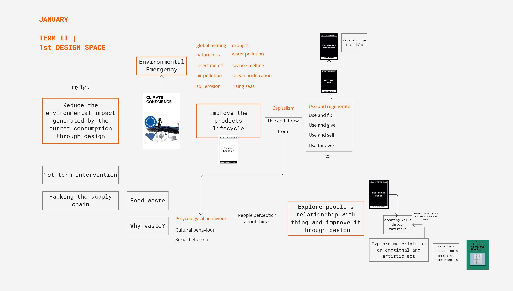

---
hide:
    - toc
---

# **Repositioning**
## January Design Space 

Term I has been a journey of introspection and exploration. A journey where I have planted seeds in topics that I have always had interest in. A journey where I have learned that many times the best way to get out mental kaos and fear is by doing.

Coming out of a professional past where I worked hours and hours between four walls, this first experience in the master's has allowed me to understand that design is much more than creating aesthetic, ergonomic and marketable products. It has helped me to face the professional reality in a more solidary way, leaving my comfort zone and collaborating with communities in the city. 

After this first intervention I have understood that part of the current problem of consumerism is based on the perception that people have with the objects they use in their day to day. A psychological, cultural, or social behavior in which affection and value about the things around us has been lost. If we look back and analyze the behavior that our ancestors had with their goods, we can highlight that they had other perceptions about the value of things.  When something didn't work, they fixed it or reused it for other functions. Currently, we live in a system where we are continuously driven to buy, without even stopping to think if we really need it. A false abundance, where we tend to measure our wealth based on the things we own and not the use we give it. 

I really believe that materials have an important role to convey emotions and values in the final artifact. In term II, I would like to explore the emotions that are elicited in the encounter between humans, materials and the context in which they operate. Considering the increase in the use of new materials and the consequent deple-tion of natural resources. Creating a sensorial and interactive experience with materials. The main focus is to investigate the expressive-sensorial qualities through an exploratory and experimental approach.  

I am also interested in regenerative materials and to learn more about permaculture and its principles. 
