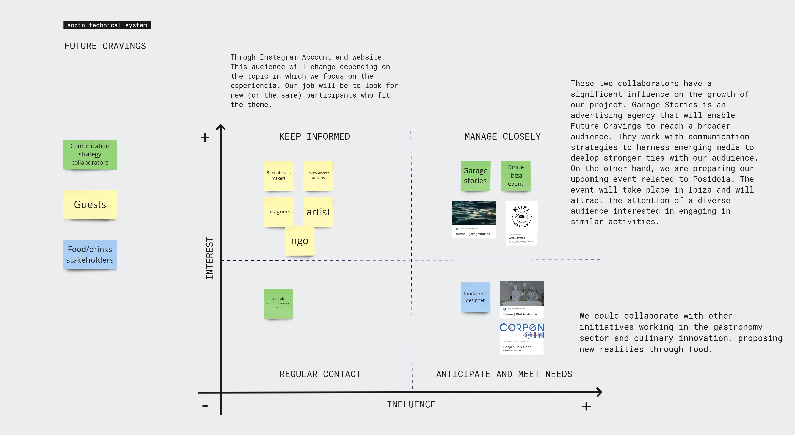

---
hide:
    - toc
---

# **Scalability** 

 23/05/2023

 ## Stakeholders map

 I have developed this map to provide stakeholders of our project "Future Cravings" with a visual representation, aiming to explore potential avenues of growth in relation to the actors involved. In summary, our upcoming projects will enable us to enhance our communication strategy and expand our audience. By engaging in strategic partnerships, we can leverage shared resources, knowledge, and expertise to foster the development and expansion of our project. Such collaborations will not only enhance our communication strategy and broaden our audience but also enable us to tap into new markets, access additional funding opportunities, and benefit from synergies that arise from working collectively towards a common objective. Through these collaborative efforts, we aim to accelerate the growth and impact of our project, while also contributing to the advancement of the broader field in which we operate.

 

