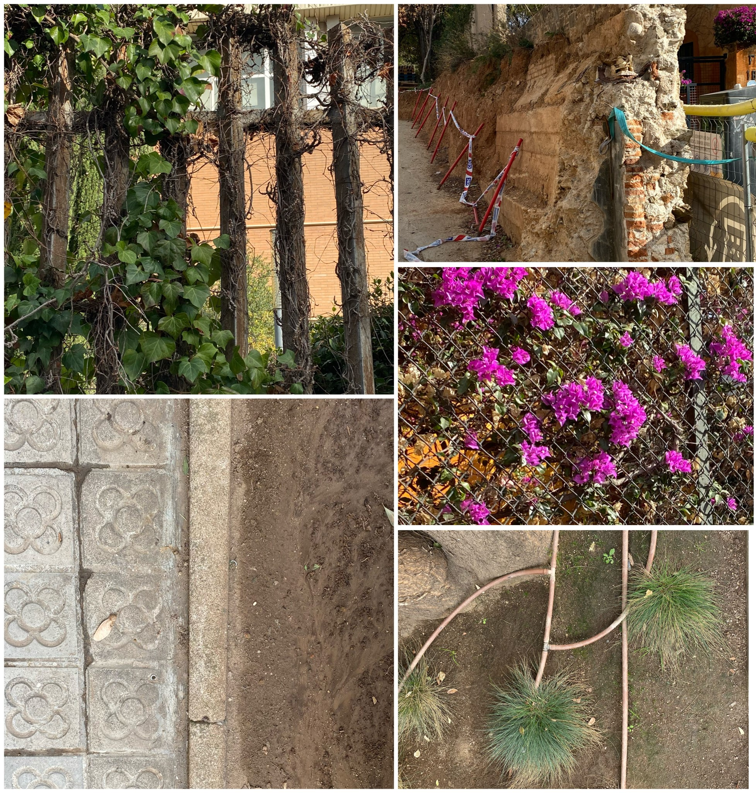

---
hide:
    - toc
---
# **Design for the next billion seconds** 

(Jan 11 - Jan 13)

This first session of term II has allowed me to have a critical thinking about the present we live and the futures we will live. Hypothesizing about what is going to happen in the next one billion seconds. 

This course carried by Andres Calamaru has been a great chance to ask ourselves questions on how we would like to live 30 years from now. These reflections have been good to project my future and have helped me to have a more critical view of my time, how I spend it and how I would like to spend it.

From the lesson one I extracted this three reflections:

- **We can not save the world but we can take care of it.** Currently, there is great pressure on young people due to the concern that exists for the environmental emergency. It is believed that young people have a responsibility to save this world, but I do not believe that it is about saving, it is about caring for and respecting our planet and all the living beings that take part in it. It's about making good decisions that help create a more ethical and responsible world. This reflection reminds me of something my mother always tells me: "no hay que preocuparse, hay que ocuparse" (no need to worry, you have to deal with it).
- **From individualism to collaborative way of living.** It is about seeing the system not vertically but horizontally, more egalitarian and supportive. I firmly believe that we are an interdependent society and that we need each other to live. A more collaborative world is for me a world that respects what is different, that favors more democratic decision-making. 
- **Designing for more solidary futures.** 

It was interesting to think about different realities, imagining hopeful futures that will manage to face the current problems, writing a letter from myself in 2050 and others. I really liked to start like this the trimestre, with a critical hope thinking. 

Some photos from thrid lesson:

