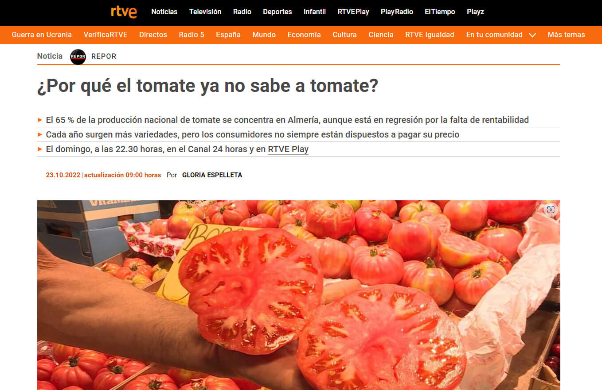

---
hide:
    - toc
---

# W1-Bio&AgriZero
## Biological point of view 

### **New 1 : Why does the tomato no longer taste like tomato?**

The tomato is one of the most popular and consumed vegetables in the world. It offers a wide assortment of varieties with different shapes and colors, but the taste has changed. The tomato no longer tastes like tomato.

This is due to a change in the genetics of the fruit, which has been modified to increase the productivity of the plant (size and quantity of the fruit) and not to increase or improve the taste of the tomato.

But, **how is the genetics of a tomato manipulated?**

This process is carried out by modifying the structure of the DNA contained in the cells of the organism, copying, deleting, inserting or moving long sequences from one point to another in the genome (total sequence of DNA possessed by a particular organism).

To increase the size of the tomato, copies of the gene that determines the size of the fruit are increased. In this way, the production of the same is increased.

And, **how can the original taste be returned to the tomato?**

Several studies have identified a genetic code responsible for 13 chemical compounds associated with flavor, which abound in ancestral tomato varieties. Using a new technique called CRISPR (Clustered Regularly Interspaced Short Palindromic Repeats) you can cut (ctrl X) and paste (ctrl V) various DNA sequences so that the tomato grows with the genetic properties of ancestral tomatoes. 

### **New 2 : Why scientist want to help plants capture more carbon dioxide.**
