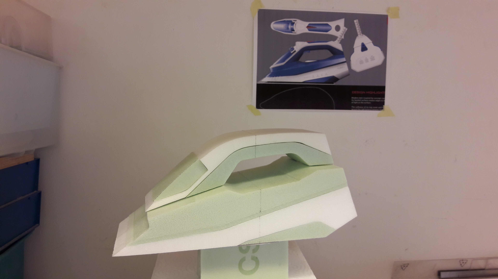

---
hide:
    - toc
---

# **RtD Toolbox**
## Reflection of the prototyping roles

During my professional career as an industrial design engineer, the prototyping phase has not been carried out in most of the projects. According to the methodology used in the design projects, the prototyping phase is carried out after the analysis and research phases (market analysis, user analysis, concept research, state of the art...), conceptualization phase (ideation phase), product development (measurements, materials, 3D modeling, rendering...). Consequently, not much has been delved into the subject. 

The only time I have made prototypes has been to analyze and explore the ergonomics of the product. As a tool to identify future functional problems. Thus, of the 4 prototyping roles I have used **Role 1: Prototyping as an experimental component.**

As for the question of what prototyping role I would like to use in relation to my fight, my vision and my desire for professional identity, I am interested in using **Role 2: The prototype as a means of inquiry**, as a tool of empathy and **Role 4: The prototyping process as a research vehicle**. The latter could be a good method for the research and development of new sustainable materials, where the main objective is to analyze and explore how the product is crafted. 

In addition to these two Roles, I would also like to explore more in **Role 1**, which I firmly believe is a fundamental method for any product with a good aesthetic and functional design.

## Map of my resources

The aim of this map is to understand what I have around that can be used in my design process.  Being aware of this will allow me to know what I am capable of doing.

.jpg)