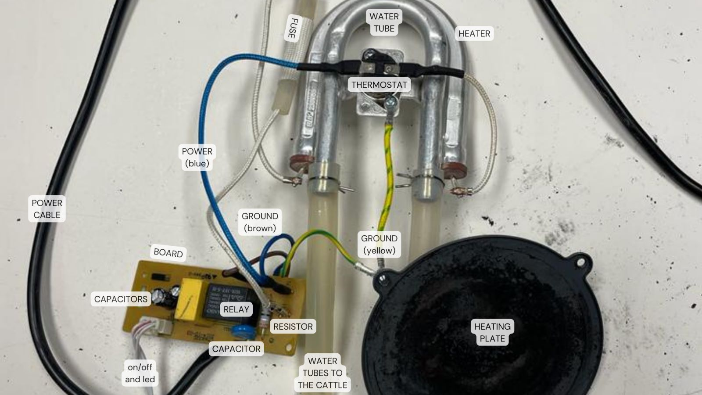

---
hide:
    - toc
---

# Tech Beyond the Mith 

WEEK 7/11 - 20/11

These two weeks we have been exploring technology and everything that lies behind it. Thanks to this program has helped me understand that the current system in which we live is only motivated by economic reasons, sell and consume more. In this way, they create products that after a period of time, calculated in advance by the manufacturer or company, stop working and are irreparable. The electrical components are hidden inside a black box, apparently difficult to obtain and understand. Once this barrier is crossed you understand that the technology used to operate the machine is not as complicated as it seemed and even those electrical components could be used for other purposes or replaced by others without the need to buy a new product.

## Drip coffee pot unpacking
 

**What surprised me?**
- The technological design of this coffee machine seems at first complex. But it actually uses very simple operating systems.
- The use of Low-Tech sistems: water level metric scale, coffee dripper (from the filter to the kettle).
- When we first saw the machine (big plastic case) we thought that the electrical components would occupy more space, it turns out it doesn't require so much plastic. It was surprising to find so much plastic material to store so few electrical components: thermostat, heater, board and button + LED.

- Smart materials is using material properties to our advantage as designers.
- Use of metal components, without any functional purpose, to give the product a more elegant and quality appearance.