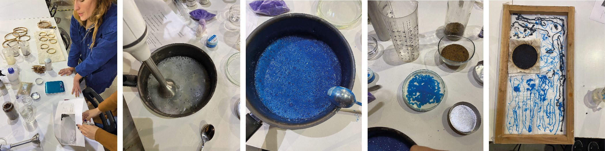

---
hide:
    - toc
---
# **Remixing Materials** 

## Week one reflection 
**January 18**

In this first session of the Remixing Materials course, Lara Campos has introduced us to the basic concepts of biomaterials.

Lara began the session by introducing us to the projects she had been working on over the past few years. It was very inspiring to see all those solutions he proposes through biomaterials. Personally, I was very interested in the project "Be grounded". A project that proposes to improve the relationship between humans and nature through materials, using an emotional and artistic language. Also, I liked all those projects that use food waste, especially the "En(des)uso" project, which proposes various solutions to what we have always considered useless and invalid.  I have to say that I was already aware of some of the projects presented, thanks to the intervention I made in Term 1 on food waste. 

Then, Lara briefly presented the history of materials and how they have influenced each era of the evolution of human beings, allowing us to improve our quality of life.  Also, we contextualize the current problem of using materials as unlimited resources and the impact this is generating on the biosphere. 

On the other hand, he also emphasized that materials are more than their functionality and properties, they can also serve as tools to convey emotions, feelings and sensations. Proposing to the designers to select the materials to generate an interactive and sensory experience in the users. This area of exploration is of great interest to me. In my opinion, I think that there is currently a lack of value and affection for the materials that surround us, and therefore for the artifacts we use in our day. I firmly believe that materials can improve that relationship between people and objects. I also believe that the implementation of materials adding emotional values can help improve the life cycle of products, and consequently, the impact they have on the environment.

Finally, we had the opportunity to experiment with biomaterials using food waste as addictive. In the case of our group, we use avocado skin to create bioplastic fibers. 

**January 19**

This class was taught at Elisava by Laura Freixas, a former MDEF student. Laura showed us several projects that propose solutions for the recirculation of materials. He also presented us with the project that we should do in these two weeks.   Later, we visited Elisava's material library where we had the opportunity to touch, feel and analyze some of the samples of the materials and also showed us interesting books about the materials. Specifically, I found one that might interest me for my project: "Material experience: fundamental of materials and design". 

**January 20**

## Materials Narrative 

  <iframe loading="lazy" style="position: absolute; width: 100%; height: 100%; top: 0; left: 0; border: none; padding: 0;margin: 0;"    src="https:&#x2F;&#x2F;www.canva.com&#x2F;design&#x2F;DAFYYtVHk1w&#x2F;view?embed" allowfullscreen="allowfullscreen" allow="fullscreen">  </iframe>
<a href="https:&#x2F;&#x2F;www.canva.com&#x2F;design&#x2F;DAFYYtVHk1w&#x2F;view?utm_content=DAFYYtVHk1w&amp;utm_campaign=designshare&amp;utm_medium=embeds&amp;utm_source=link" target="_blank" rel="noopener">Presentación de negocio ilustrado neutral</a> de June Bascaran Bilbao

