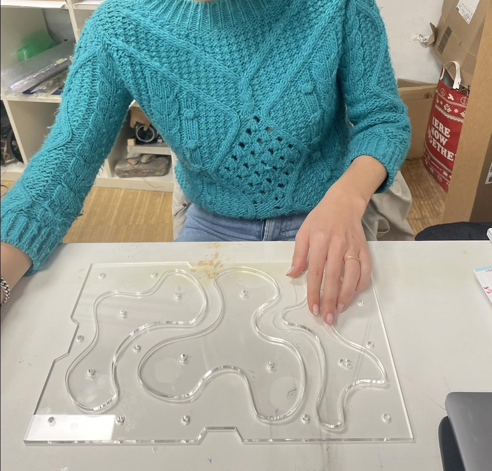

---
hide:
    - toc
---
# **Prototyping for design** 

This section will be part of a weekly journal where I’ll be documenting what we are doing during the course Prototyping for Design. This will allow me to have a place to document everything I am learning, and in the future, if I wanted to use some of these tools, I can have a place where I can take a look.

## Electronics & coding  
**01/02/2023**

In this first class Victor has introduced us to the basic concepts of electronics and programming. 

**Task 1: Playing music with Arduino**
We were reintroduced to Arduino receiving the first task of this session in which we have to create music with an ESP32 and a buzzer. 

To creating music with Arduino and buzzers we used a ESP32 microcontroller, a piezo buzzer that is an electronic component that can make sounds, a bread board and connection wires and pins which are then connected through Arduino IDE and code to make sounds. 

Even though this topic is difficult for me to work with, there are a lot of online tutorias to make it easy. For this exercise I follow the instructions of one of the examples I have found on the Internet, which explains step by step everything you should do.

 
<iframe src="https://player.vimeo.com/video/795218037?h=b5cd0ec3da&amp;badge=0&amp;autopause=0&amp;player_id=0&amp;app_id=58479" frameborder="0" allow="autoplay; fullscreen; picture-in-picture" allowfullscreen style="position:absolute;top:0;left:0;width:100%;height:100%;" title="TASK1"></iframe>

## Digitalizing realities   
**02/02/2023** 

In this class we had a presentation about digital tools for 2D, 3D, parametric and generative deisgn. We started off by communally adding programs we have worked with in the past to a Miroboard. I have used 2D and 3D programs for modelling before such as Illustrator, Rhino, Solidworks, NX, Cinema 4D to create 3D and 2D models and files for digital manufacturing. Also, I saw so many interesting programs and other ways of working. 

In relation to the development of my future projects I am interested in using the following tools:

- Womp 3D: Womp is a 3D software company that makes it simple for users to bring their 3D ideas to life. Womp's support for social and collaboration features, which encourages users to learn from one another, improve their 3D design skills, and share their works. 

- Adobe Illustraitor: Adobe Illustrator (AI) is a vector graphics editor used for editing, among other things (illustration as a branch of digital art applied to technical illustration or graphic design, among others).

- Thingiverse: Thingiverse is a website dedicated to the sharing of user-created digital design files. Providing primarily free, open-source hardware designs licensed.  3D printers, laser cutters, milling machines and many other technologies can be used to physically create the files shared by the users on Thingiverse.

- Blender: is a cross-platform computer program, dedicated especially to modeling, lighting, rendering, animation and creation of three-dimensional graphics. Also digital composition using the node procedural technique, video editing, sculpture (includes dynamic topology) and digital painting.

- FlatFab: flatfab is software that helps you design and fabricate 3D objects. 3D printing in new-age materials is great for small complex objects, but prohibitive in time and money for anything bigger than your fist.

As an exercise, during the presentation, we had to represent a croassant in a parametrical way. We could draw it by hand, digitally or directly on Miro. I drew it by hand quickly without thinking too much. 
1.jpg)

**Task 2: Testing with Blender**
For the exercise of this class we must use one of these tools presented to put into practice. I chose Blender because I have never used it and because there are a variety of options to create the object, such as, lighting, rendering, animation and creation of three-dimensional graphics.

I have used an internet tutor to guide me step by step and I have realized that all the tools I have used in my past, such as Cinema 4D, are very similar but different at the same time. Each uses a different language and learning a new language is usually not easy at first. 

I really liked the program but I still have to put it into practice more to get better results. 

<iframe src="https://player.vimeo.com/video/796092321?h=a8a0bedb2f&amp;badge=0&amp;autopause=0&amp;player_id=0&amp;app_id=58479" frameborder="0" allow="autoplay; fullscreen; picture-in-picture" allowfullscreen style="position:absolute;top:0;left:0;width:100%;height:100%;" title="Task 2.mp4"></iframe>

**AI render in Blender**

<iframe src="https://player.vimeo.com/video/797090466?h=268c80eed6&amp;badge=0&amp;autopause=0&amp;player_id=0&amp;app_id=58479" frameborder="0" allow="autoplay; fullscreen; picture-in-picture" allowfullscreen style="position:absolute;top:0;left:0;width:100%;height:100%;" title="Ai render Blender.mp4"></iframe>

## 2D Fabrication   
**08/02/2023** 

This week we have been introduced to the laser cutter. In my past I had already used it but this session has been good for me to refresh my knowledge.In the image shown below was my first object that I created with the laser cutter, allowing to put into practice the knowledge acquired in the class.

**Benefits of Laser cutting for prototyping**

This tool offer a high level of precision, accuracy and speed, making it possible to quickly create complex shapes and designs with ease. 

One of the main benefits of using a laser cutter for prototyping is the ability to quickly produce accurate and high-quality prototypes. With a laser cutter, it is possible to create intricate designs and shapes with precise dimensions and clean edges, which can greatly improve the overall quality of the final product.

Another advantage of using a laser cutter for prototyping is the ability to work with a wide range of materials. From wood and acrylic to metals and textiles, laser cutters can work with a wide range of materials, making it possible to produce prototypes that closely resemble the final product.

**Task 3: Using the lasercut**
To put theory into practice we were to use a method to Laser cut something. Currently, I am in a project where we are experimenting with biomaterials. I have taken this opportunity to create molds for the development of this project. 

Next, I show step by step the process for the creation of these molds with the laser cutter.

  <iframe loading="lazy" style="position: absolute; width: 100%; height: 100%; top: 0; left: 0; border: none; padding: 0;margin: 0;"
    src="https:&#x2F;&#x2F;www.canva.com&#x2F;design&#x2F;DAFaYdgU22Y&#x2F;view?embed" allowfullscreen="allowfullscreen" allow="fullscreen">
  </iframe>

<a href="https:&#x2F;&#x2F;www.canva.com&#x2F;design&#x2F;DAFaYdgU22Y&#x2F;view?utm_content=DAFaYdgU22Y&amp;utm_campaign=designshare&amp;utm_medium=embeds&amp;utm_source=link" target="_blank" rel="noopener">LaserCut steps</a> de June Bascaran Bilbao

## Inputs & outputs   
**09/02/2023** 

The second part of the week we learned about inputs and outputs, looking at different sensors, what they can do and how. 

Sensors play a critical role in a wide range of applications and are essential for many modern technologies. For example, automation, robotics, healthcare, environmental monitoring or smart homes. They are used to gather data about the physical world and convert that information into electrical signals that can be processed and analyzed by computer systems. 

**Task 4: Testing sensors with Arduino**
As an excercise we tryed to use a sensor and actuator to comunicate, using a simple Light Dependant Resistor (LDR) and a LED. To perform this exercise more easily, we did it in parts. First, we tried turning on the LED with a button. To do this, we use a code provided by Arduino IDE, in which, you only have to change the number of the Pin. 

After this part worked, we tested the LDR with another board. Light Dependent Resistor (LDR) acts as a light sensor that can detect changes in light intensity and adjust the circuit accordingly.

## **MICROCHALLENGE I**
**14/02/2023 - 17/02/2023**

For this first challenge, I teamed up with Paige and Sami since we are in the same proyect and all three of us are interested in experimenting with biomaterials. The goals for this Challenge were to apply the things learnt during the past weeks in Prototyping for design: electronics and couding, 2D and 3D modelling, laser-cut and vinyl cut. 

After experimenting with many materials, we realized that we needed to develop molds for our future projects. We took this opportunity to develop a bio presser that would allow us to shape the final product. To do this, we defined the following variables: a low-tech bio presser for non-sticky biomaterials, interchangeable molds, and consistent pressure.

The most challenging part of this bio presser was making it interchangeable with other molds so that we could shape the material in different ways. Our plan then was to create a flatter mold that could produce three simple, blob-like modular plates.

We started the project by brainstorming ideas and drawing sketches. At first, we thought that developing this project would be easy, but soon we realized that it was more complicated than we expected. It was important to consider many variables, such as ventilation holes, the mold material, and the shape of the plates.

We modeled the mold using Illustrator and Rhino software so that we could cut it using a laser cutter.

We created a variety of prototypes to bring our ideas to reality. This helped us a lot in identifying future problems with the mold. The idea behind this project was to create a bio presser that could make it easier to develop our future projects. I would have liked to create a mold that would allow us to interchange different shapes. It would also have been interesting to include a moisture sensor or a timer device.

In conclusion, this mold could be improved in the future to create other products with different shapes, and it could be a tool that is available to anyone interested in experimenting with biomaterials and creating their products in a simple and straightforward way. For the next challenge, I would like to approach the project differently, perhaps not so technically focused, and more geared towards creating a tool or prototype that facilitates interaction between the user and the product.

You can find more information about the proyect by tapping here: https://hackmd.io/6WUepphCRT2BhSNGhIL4Ww

## Networking    
**22/02/2023** 
During this class, we discussed the intricacies of the internet and its role as a revolutionary duplication tool. Functioning as an interlinked web of devices, networks facilitate the seamless exchange of information through various communication channels.

**What is a network?**
A network is a collection of devices, such as computers, printers, and smartphones, that are connected to each other using some form of communication technology, like wires, cables, or wireless signals. These devices can communicate with each other and share information, resources, and services, which can be useful in a variety of contexts, from homes and offices to large corporations and the internet itself.

## 3D fabrication & scanning    
**23/02/2023** 

This week's topic of FabAcademy was 3D printing and scanning. During the theoretical class, the FabLab team explained a bit the story of 3D printing, starting from the first SLA printers and the RepRap project until nowadays where there are 3D printers for literally everything. They also explained the functioning of the main 3D printing technologies and the materials that are normally used in each of them.

Then, we were told about how to slice a 3D modelled part to have the optimal result. Many parameters have a direct effect on the final printed part such as layer height, infill, directionality, shell, etc. It's necessary to set a proper configuration for each part, using a slicing program like Cura. For that, you need to have the part in a mesh format that can be STL, OBJ or 3MF generally. Preferably, STL. 

After the 3d printing introduction, it was the turn for 3D scanning. FabLab team procceded to show us some ways to scan using diverse programs and methods. 

This session has been of great interest to me. I think that 3D printers has revolutionized the way we see product design.  One of the most exciting developments in 3D printing is the increasing availability of high-quality. As these printers become more widely available, designers will have even greater flexibility in their designs and will be able to produce complex shapes and structures with ease. Also, the wide range of materials that can be use in this technologies is a very important factor for the work of designers. 

**Task 5: 3D printing & scanning**

PART 1 | 3D PRINTING: For the practical exercise of this session we need to print using 3D printer and then scan it. To do this, I started by creating the model in Blender and then saved it in STL. I created a candle plate in which it will create a visual effect with the shadows while the candle is consumed. 

Then, transfer the file to the Cura program and change the parameters necessary for printing, such the infill,speed, supports and temperature. Once we have all these parameters correct, we preview the printing process and send it to the card. Then this card is placed on the machine. We look for our file and give it to PRINT. 

The organic shapes of this object need many supports to be manufactured. This will damage the final texture of the object, but it can be fixed by sanding it. 

  <iframe loading="lazy" style="position: absolute; width: 100%; height: 100%; top: 0; left: 0; border: none; padding: 0;margin: 0;"
    src="https:&#x2F;&#x2F;www.canva.com&#x2F;design&#x2F;DAFb21u2K60&#x2F;view?embed" allowfullscreen="allowfullscreen" allow="fullscreen">
  </iframe>

<a href="https:&#x2F;&#x2F;www.canva.com&#x2F;design&#x2F;DAFb21u2K60&#x2F;view?utm_content=DAFb21u2K60&amp;utm_campaign=designshare&amp;utm_medium=embeds&amp;utm_source=link" target="_blank" rel="noopener">Copia de LaserCut steps</a> de June Bascaran Bilbao

PART 2 | 3D SCANNING: 

<iframe width="640" height="360" src="https://www.youtube.com/embed/LlaA-549iXo" title="3D Sacnning" frameborder="0" allow="accelerometer; autoplay; clipboard-write; encrypted-media; gyroscope; picture-in-picture; web-share" allowfullscreen></iframe>

## Interfaces - machine interactions   
**01/03/2023** 

In this class we have been working with Arduino, trying to turn on a LED in different ways:

- The hardcoded way (Exercise 1)
- Asking for it (Exercise 2)
- Making it do animations (Exercise 3)
- Asking for it from the internet (Exercise 4 and 5)
- Making sensors do it remotely (Exercise 6)

**Exercise 1: The hardcoded way**
For this exercise we use the code that Arduino provide, called Blink. The only thing that we have to change is the pin number. 

**Exercise 2: Asking for it**
For this one, we changue the code to be able to write "blink" in the monitor and the Led makes the funtion.

**Exercise 3: Making do animations**
We install the library Jled to have new funtions for the Led, such us, breathe, candle, fade on, fade off, etc. 

**Exercise 4 and 5: Asking for it from the internet**
In this case, we are going to ask to turn on the Led trough online network. To do this, we create a code that allows you to connect to a Wi-Fi network. In this way, we can control the parameters of the Led from the internet. (Exercise 5): After getting it we also add a new function for the Led, in my case, candle mode. 

**Exercise 6: Making sensors do it remotely**

## CNC    
**02/03/2023** 