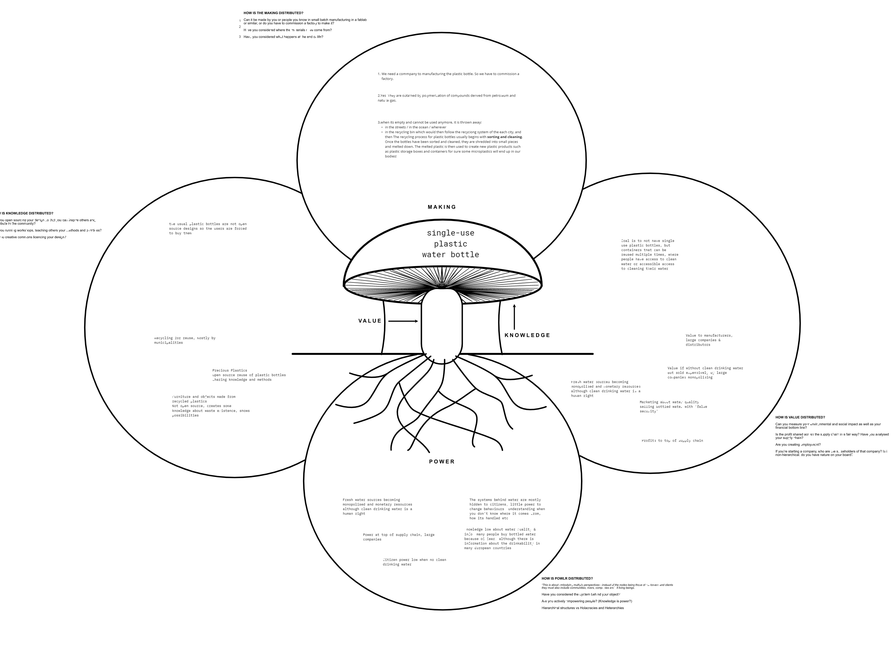
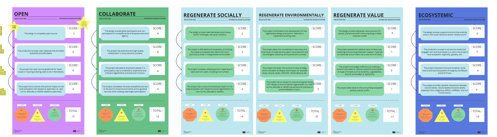
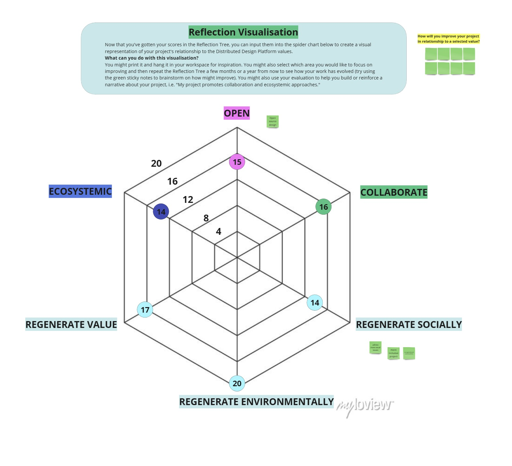

---
hide:
    - toc
---
# **Distributed Design** 

## Reflection 1: Mushroom Model

### Learning skills 
For this exercise I use communicaton, flexibility and active listening skills. Communication for explaining the exercise in a effective way. Flexibility for being open for new ideas and approaches, as well as being able to adapt to changing circumstances. 
### Dynamics 
This exercise has been done with Myrto and Josephine and the dynamics have been better than previous ones. This type of exercise they come out better if they are done in groups and different perspectives are shared.
### Interactions 

## Reflection 2: Reflection tree

For the reflection tree I have chosen one of my projects from last semester to reflect on what I can improve. The project is about collecting microplastics from the beach with the Beach Clean Initiative. My group and I volunteered to clean the beaches and tested and developed different tools to collect microplastics from the sand.

### Learning skills 
With this exercise, I have used skills that have allowed me to self-evaluate on the different values of distributed design. Skills such as being able to view my project and interventions from a different perspective to see what I have done well and what I can improve. 
### Dynamics 
I was not able to do this reflection exercise collectively with my other group mates. Perhaps it would have been more dynamic if I had been able to share this evaluation jointly. I also believe that it would have been helpful to see different points of view and evaluate our project more effectively. Anyway, it has been interesting to evaluate the project in relation to the proposed values. Certain values that are not so present in the project can be identified, such as addressing social challenges. 
### Interactions 
As I said, I have done this exercise individually and have not been able to interact with anyone. I would have liked to share it with someone to be able to reflect on it.

## Personal Reflection 

The distributed design approach has the potential to have a significant impact in the future, as it offers a more collaborative and inclusive way of addressing the complex and changing challenges facing the world today.

One of the main benefits of distributed design is that it encourages the participation and inclusion of different actors and communities in the design process, which can lead to more relevant and sustainable solutions. By involving different perspectives and skills, more innovative and effective solutions for complex problems can be found.

Additionally, the focus on regeneration and sustainability in distributed design can have long-term benefits for the environment and society as a whole. 

Distributed design can also contribute to the creation of stronger and more connected communities, by fostering collaboration and active participation in the design process. This can lead to greater social cohesion and a stronger sense of community belonging.

With the growing automation and digitalization of production, the question arises whether there will be designers in the future or whether anyone can produce whatever they want whenever they want. The role of the designer is evolving and transforming. Increasingly, designers are adopting a more collaborative and inclusive approach in their work, working closely with other professionals and communities to create more relevant and sustainable solutions. However, I think that in the future the role of design will continue to be an important role in creating innovative and effective solutions. 

